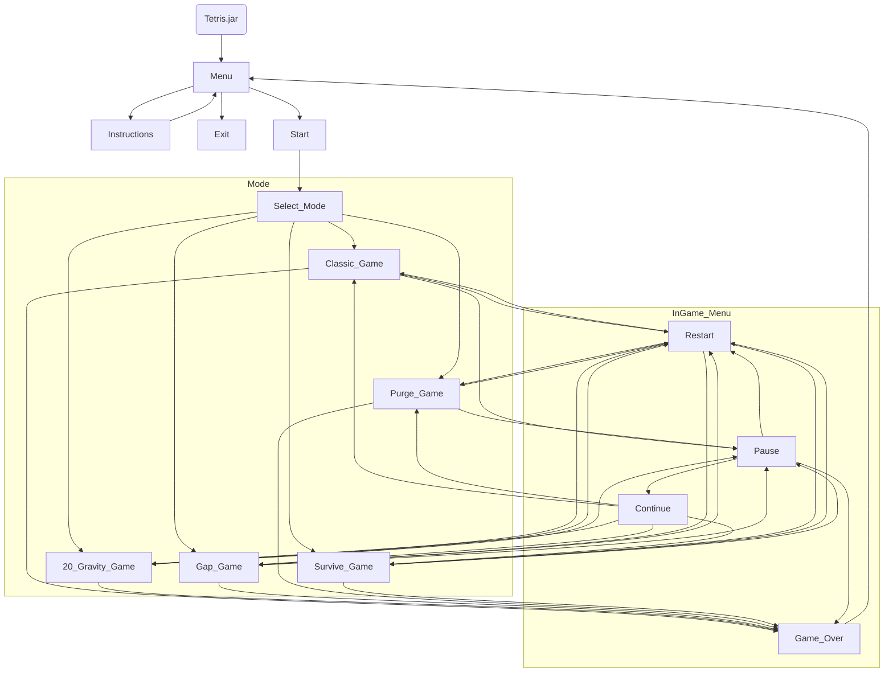
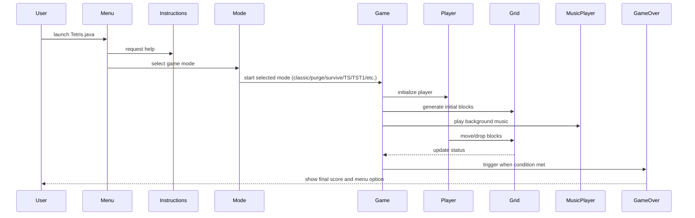

# JAVA_11302_Tetris
B11007111 胡予肴 B11007131 潘永牧  
  遊戲影片連結：https://youtu.be/44LgBPtJe8g

## 簡介
本遊戲為經典遊戲俄羅斯方塊的延伸版本，加入多種進階玩法，遊戲中也支援 T-Spin、Back To Back、Combo、全清……等高端技巧判定。本遊戲還設計了雙人對戰模式、合作模式與20G高速模式，適合喜愛俄羅斯方塊的玩家挑戰自我或與好友同樂，並搭配了豐富的效果、音效與震動畫面，打造出完整且富娛樂性的方塊消除遊戲體驗。  
## 遊戲說明
### 1.遊戲流程
- 螢幕上方不斷掉落不同形狀的方塊  
- 玩家要在方塊落下過程中移動、旋轉方塊，讓它們排列在底部  
- 當一行方塊排滿時，該行就會消除
- 玩家可通過消除方塊或高端的操作來得分
- 方塊若堆疊到螢幕頂端，遊戲結束
- 盡可能在遊戲結束前得到最多分
### 2.遊戲模式
- classic (單人經典模式)
- 20 Gravity (單人困難模式)
- Gap (雙人對戰攻擊模式)
- Purge (雙人對戰困難模式)
- Survive (雙人合作生存模式) 
### 3.操作說明

### 4.分數 與 攻擊行數

## 更新日誌
### (week 1)  
#### v1.0  
1.建立基底程式  
2.添加左右下移動  
3.添加旋轉  
4.繪製玩家方塊與格線  
-lilmu  
  
#### v1.1 (week 1報告)  
1.修復drop沒有生成新方塊  
2.更改操作鍵: num_2=逆轉 num_3=順轉 num_0=硬降  
3.創建背景陣列  
4.可判定並放置方塊  
5.為不同方塊上色  
6.方塊可以簡易的踢牆  
-Maple  
  
### (week 2)  
#### v1.2  
相同的功能，但將玩家和場景分割出來物件化  
-Maple  
  
#### v1.3  
1.優化旋轉功能，以符合SRS標準  
2.添加隨機器7-bag: 方塊不是完全隨機，而是產生7個方塊後打亂順序再出，降低運氣成分  
-Maple  
  
#### v1.4  
1.添加並顯示預覽塊  
2.添加並顯示暫留塊  
3.設定暫留塊功能鍵: NUM_1   
-Maple  
  
#### v1.5  
1.大幅優化踢牆功能，現在可以像正規Tetris一樣旋轉進看似無法移進去的位置  
-Maple  
  
#### v1.6 (week 2報告)  
1.添加消除和統計分數功能  
2.添加遊戲結束(失敗)判定  
3.添加結束畫面(可重來)  
4.右側UI優化  
-lilmu  
程式合併  
-Maple    
  
### (week 3)  
#### v1.7  
1.禁用輸入法防止中文輸入法卡按鍵  
2.更改軟降方式(原本為按一次下降一格)為壓著後加速  
3.引入幀數(重力)控制  
4.添加鎖定延遲，落地後不會馬上鎖定  
-Maple  
  
#### v1.8  
1.為鎖定延遲添加特效指示(漸暗)  
2.添加陰影塊  
3.調整計時器到60fps  
-Maple  
  
#### v1.9  
1.大改頁面架構來方便新增頁面、更改頁面，用不同.java檔管理  
2.添加臨時的menu頁面來測試  
-Maple  
  
#### v1.10  
1.增加背景音樂，進入遊戲時音樂開始，遊戲結束音樂結束  
2.增加消除音效  
-lilmu  
  
#### v2.0  
1.完整化計分模式，包含T-Spin、背靠背(Back To Back)、連擊、全清  
2.右下UI會顯示Level、Lines、清除時的判定、Combo等等  
3.添加Level，並且遊戲會隨Level提高下落速度(每消除10行+1 Level)  
4.添加ARS，方塊生成時會有短暫延遲才會開始下落  
5.調整視窗大小供之後使用  
6.在主選單可以透過按鍵離開遊戲  
7.程式合併(與v1.10)  
-Maple  
  
#### v2.1  
1.添加按鈕的控制架構，除了遊戲中以外的控制改為滑鼠觸發  
2.添加遊戲中暫停功能  
-Maple  
  
#### v2.2  
1.添加指示頁面，包含按鍵對應的操作和分數計算  
2.添加20G高難度模式，重力使玩家每幀下落20格  
-Maple  
  
### (week 4)  
#### v2.3  
1.方塊生成位置調整到第21和22行  
2.添加震動特效  
3.添加垃圾行產生與清除函式  
4.在指示頁面新增左右切換到消行展示(T旋示範，還待補全)  
5.添加二人對戰模式  
6.各種程式和介面的優化  
-Maple  
  
#### v3.0  
1.添加不同模式的背景音樂  
2.添加按鈕、放置、旋轉、消除、遊戲結束音效  
-lilmu  
1.添加消除特效  
2.添加第二種對戰模式  
3.添加合作模式  
4.完善消除示範頁面  
5.優化UI  
6.程式合併  
-Maple  
  
#### v3.01  
修復一些bug  
-Maple  
  
#### v3.02  
1.優化7-bag產生器  
2.消行的消除音效改為n行會產生(n+1)/2次，而不是n次  
-Maple  
## 分工表
| 成員        | 負責內容                                                                                                                                                                                                        |
| :-------- | :---------------------------------------------------------------------------------------------------------------------------------------------------------------------------------------------------------- |
| **lilmu** | - 基底程式與操作功能 (v1.0-v1.1) - 操作鍵配置 - Drop 修復與背景陣列 - 音效與背景音樂加入 (v1.10, v3.0) - 程式合併 (v1.6, v3.0)                                                                                                    |
| **Maple** | - 旋轉、踢牆、SRS、7-bag 隨機器 (含優化) - 預覽塊、暫留塊、陰影塊 - 消除、計分、T-Spin、Combo、Back to Back、全清 - Level、Lines、速度控制、20G模式 - 鎖定延遲與特效、震動、垃圾行 - 多人對戰、合作模式、暫停功能、指示頁面 - 架構改寫、多頁面管理、UI優化 - 程式合併、音效細項優化、7-bag優化 |  
## ChatGPT 協作紀錄摘要

## UML 類別圖

```mermaid
classDiagram
JPanel <|-- menu
ActionListener <|.. menu
class menu {
  +startPanel()
  +stopPanel()
  +paintComponent()
  +actionPerformed()
  +actionPerformed()
  +actionPerformed()
}
JPanel <|-- classic
ActionListener <|.. classic
class classic {
  +BK
  +p1
  +g1
  +pause
  +startPanel()
  +stopPanel()
  +paintComponent()
  +actionPerformed()
  +actionPerformed()
  +drawPause()
  +pauseGame()
  +continueGame()
  +actionPerformed()
  +actionPerformed()
  +actionPerformed()
  +actionPerformed()
}
class Grid {
  +B2B
  +getXO()
  +getYO()
  +getXS()
  +getYS()
  +getA()
  +getLinesC()
  +getScore()
  +getB2B()
  +getWin()
  +setXO()
  +setYO()
  +setXS()
  +setYS()
  +setA()
  +setLinesC()
  +setScore()
  +setBGarr()
  +setB2B()
  +setWin()
  +clearFullLines()
  +calcuateScore()
  +checkAllEmpty()
  +clearAll()
  +clearEffectssTimerDecrease()
  +switchColor()
  +draw()
}
JPanel <|-- MTS
ActionListener <|.. MTS
class MTS {
  +p1
  +g1
  +controlTimer
  +startPanel()
  +stopPanel()
  +initial()
  +paintComponent()
  +actionPerformed()
  +actionPerformed()
  +actionPerformed()
  +actionPerformed()
  +actionPerformed()
  +actionPerformed()
}
JPanel <|-- gravity
ActionListener <|.. gravity
class gravity {
  +BK
  +p1
  +g1
  +pause
  +startPanel()
  +stopPanel()
  +paintComponent()
  +actionPerformed()
  +actionPerformed()
  +drawPause()
  +pauseGame()
  +continueGame()
  +actionPerformed()
  +actionPerformed()
  +actionPerformed()
  +actionPerformed()
}
class ClearEffects {
  +timer
  +getX()
  +getY()
  +getT()
  +setX()
  +setY()
  +setT()
  +setTimer20()
  +draw()
}
JPanel <|-- mode
ActionListener <|.. mode
class mode {
  +startPanel()
  +stopPanel()
  +paintComponent()
  +actionPerformed()
  +actionPerformed()
  +actionPerformed()
  +actionPerformed()
  +actionPerformed()
}
JPanel <|-- instructions
ActionListener <|.. instructions
class instructions {
  +startPanel()
  +stopPanel()
  +paintComponent()
  +actionPerformed()
  +actionPerformed()
  +actionPerformed()
}
JPanel <|-- gameover
ActionListener <|.. gameover
class gameover {
  +startPanel()
  +stopPanel()
  +paintComponent()
  +actionPerformed()
  +actionPerformed()
}
JPanel <|-- gap
ActionListener <|.. gap
class gap {
  +BK
  +pause
  +attackTimer
  +cooldownTimer
  +sendGarbageTo1
  +sendGarbageTo2
  +startPanel()
  +stopPanel()
  +paintComponent()
  +actionPerformed()
  +actionPerformed()
  +drawPause()
  +pauseGame()
  +continueGame()
  +actionPerformed()
  +actionPerformed()
  +actionPerformed()
  +actionPerformed()
}
class MusicPlayer {
  +clip
  +play()
  +stop()
  +pause()
  +resume()
}
JPanel <|-- MTST1
ActionListener <|.. MTST1
class MTST1 {
  +p1
  +g1
  +controlTimer
  +startPanel()
  +stopPanel()
  +initial()
  +paintComponent()
  +actionPerformed()
  +actionPerformed()
  +actionPerformed()
  +actionPerformed()
  +actionPerformed()
  +actionPerformed()
}
JPanel <|-- Tetris
class Tetris {
  +keyPressed()
  +keyReleased()
  +createPages()
  +mouseEntered()
  +mouseExited()
  +mousePressed()
}
JPanel <|-- TST2
ActionListener <|.. TST2
class TST2 {
  +p1
  +g1
  +controlTimer
  +startPanel()
  +stopPanel()
  +initial()
  +paintComponent()
  +actionPerformed()
  +actionPerformed()
  +actionPerformed()
  +actionPerformed()
  +actionPerformed()
}
JPanel <|-- TST1
ActionListener <|.. TST1
class TST1 {
  +p1
  +g1
  +controlTimer
  +startPanel()
  +stopPanel()
  +initial()
  +paintComponent()
  +actionPerformed()
  +actionPerformed()
  +actionPerformed()
  +actionPerformed()
  +actionPerformed()
}
JPanel <|-- purge
ActionListener <|.. purge
class purge {
  +BK
  +pause
  +attackTimer
  +cooldownTimer
  +sendGarbageTo1
  +sendGarbageTo2
  +startPanel()
  +stopPanel()
  +paintComponent()
  +actionPerformed()
  +actionPerformed()
  +drawPause()
  +pauseGame()
  +continueGame()
  +actionPerformed()
  +actionPerformed()
  +actionPerformed()
  +actionPerformed()
}
JPanel <|-- survive
ActionListener <|.. survive
class survive {
  +BK
  +pause
  +sendGarbageTimer
  +sendGarbageTimerSet
  +sendGarbageLinesSet
  +sendCount
  +sendGarbageTo1
  +sendGarbageTo2
  +startPanel()
  +stopPanel()
  +paintComponent()
  +actionPerformed()
  +actionPerformed()
  +drawPause()
  +pauseGame()
  +continueGame()
  +actionPerformed()
  +actionPerformed()
  +actionPerformed()
  +actionPerformed()
}
JPanel <|-- TS
ActionListener <|.. TS
class TS {
  +p1
  +g1
  +controlTimer
  +startPanel()
  +stopPanel()
  +initial()
  +paintComponent()
  +actionPerformed()
  +actionPerformed()
  +actionPerformed()
  +actionPerformed()
  +actionPerformed()
}
JPanel <|-- MTST2
ActionListener <|.. MTST2
class MTST2 {
  +p1
  +g1
  +controlTimer
  +controlTimer2
  +controlTimer3
  +startPanel()
  +stopPanel()
  +initial()
  +paintComponent()
  +actionPerformed()
  +actionPerformed()
  +actionPerformed()
  +actionPerformed()
  +actionPerformed()
  +actionPerformed()
}
class Player {
  +holdS
  +hold
  +Tspin
  +speedUP
  +lastKick
  +getXO()
  +getyO()
  +getXS()
  +getYS()
  +getX()
  +getY()
  +getS()
  +getD()
  +getDF()
  +getDFS()
  +getLD()
  +getLDS()
  +getARE()
  +getARES()
  +getTspin()
  +getSpeedUP()
  +getLK()
  +setXO()
  +setYO()
  +setXS()
  +setYS()
  +setX()
  +setY()
  +setS()
  +setD()
  +setDF()
  +setDFS()
  +setLD()
  +setLDS()
  +setARE()
  +setARES()
  +setShape()
  +setTspin()
  +setSpeedUP()
  +setLK()
  +spawn7bag()
  +spawnNewShape()
  +holdCurrentShape()
  +rotate()
  +switchColor()
  +draw()
  +drawShadow()
}
JPanel <|-- TST3
ActionListener <|.. TST3
class TST3 {
  +p1
  +g1
  +controlTimer
  +controlTimer2
  +startPanel()
  +stopPanel()
  +initial()
  +paintComponent()
  +actionPerformed()
  +actionPerformed()
  +actionPerformed()
  +actionPerformed()
  +actionPerformed()
}
```

## 流程圖

## 序列圖

